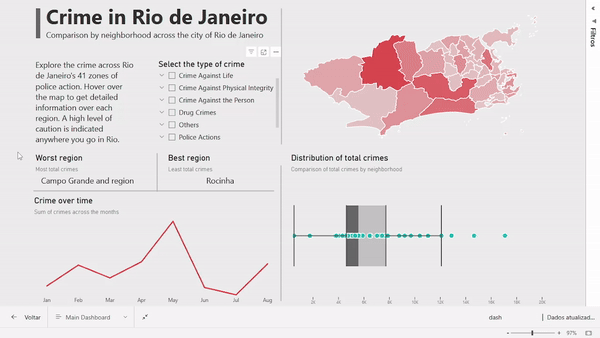

# Crime in Rio de Janeiro

A PowerBI mapping of crime in the city of Rio de Janeiro. The map visual is customized to take into account the zones of police action across the city.



## Project Structure
```
├── data/
│   ├── BaseDPEvolucaoMensalCisp.csv # criminality data from the state police
│   ├── crime_references_table.csv # crimes reference sheet
│   └── Relacao_RISPxAISPxCISP.csv # regions reference sheet
│
├── map_files/
│   ├── CISPshp/
│   ├── rio_shapefile/
│   ├── qg_rio.qgz
│   └── rio_city.json # topoJSON utilized to customize the map visualization
│
├── crime_rio_dashboard.pbix # PowerBI file
│
└── README.md
```

The data available is raw. Further processing was done in Power Query with m language.

## Disclaimer

Although the data is real, exert a high level of caution anywhere you go in Rio de Janeiro.